# Mini NPU 시뮬레이터

Python으로 구현한 간단한 **NPU(Neural Processing Unit) 연산 시뮬레이터**입니다.

이 프로젝트는 실제 NPU 하드웨어를 만드는 것이 아니라, NPU에서 자주 사용되는 핵심 연산인 **MAC(Multiply-Accumulate, 곱셈-누산)** 을 순수 Python으로 직접 구현하고, 그 결과를 이용해 입력 패턴이 **Cross(+)** 인지 **X** 인지 판별하는 과정을 학습하기 위한 미니 프로젝트입니다.

> 처음 이 프로젝트를 보는 분이라면 `main.py`부터 읽기보다, 아래의 **전체 동작 흐름 → 파일 역할 → MAC 연산 → 실행 방법** 순서로 읽는 것을 권장합니다.

---

## 1. 이 프로젝트는 무엇을 하는가?

가장 간단하게 표현하면 다음과 같습니다.

```text
입력 패턴
   ↓
Cross 필터와 비교 ──→ Cross 점수
   ↓
X 필터와 비교 ──────→ X 점수
   ↓
두 점수 비교
   ↓
Cross / X / UNDECIDED
```

프로그램은 하나의 입력 행렬을 두 개의 필터와 각각 비교합니다.

- **Cross 필터**: `+` 모양을 잘 찾도록 만든 필터
- **X 필터**: `X` 모양을 잘 찾도록 만든 필터
- **MAC 연산**: 입력과 필터의 같은 위치 숫자를 곱한 뒤 모두 더함
- **판정**: Cross 점수와 X 점수 중 더 큰 쪽을 선택
- **UNDECIDED**: 두 점수가 사실상 같으면 어느 쪽인지 결정하지 않음

---

## 2. NPU와 MAC을 아주 쉽게 이해하기

### 2.1 CPU와 NPU를 왜 구분하는가?

CPU는 다양한 종류의 작업을 처리할 수 있는 범용 프로세서입니다.

반면 NPU는 **신경망 연산처럼 반복되는 숫자 계산을 빠르게 처리하는 것**에 초점을 둔 프로세서입니다.

이 프로젝트에서는 실제 NPU 하드웨어의 복잡한 구조를 모두 구현하지 않고, 그중 핵심적인 계산 하나를 단순화해서 구현합니다.

바로 **MAC**입니다.

### 2.2 MAC이란?

MAC은 다음 두 작업을 합친 것입니다.

- Multiply: 곱하기
- Accumulate: 계속 더하기

예를 들어 입력과 필터가 다음과 같다고 가정해 봅시다.

```text
입력                필터

1  0  1              0.1  0.0  0.1
0  1  0      ×       0.0  0.9  0.0
1  0  1              0.1  0.0  0.1
```

같은 위치끼리 곱하고 모두 더합니다.

```text
(1×0.1) + (0×0.0) + (1×0.1)
+ (0×0.0) + (1×0.9) + (0×0.0)
+ (1×0.1) + (0×0.0) + (1×0.1)

= 1.3
```

즉, MAC은 다음과 같은 계산입니다.

```text
score = 모든 위치에서 (입력값 × 필터값)의 합
```

프로젝트의 `engine.py`에서는 이 계산을 Python의 중첩 `for`문으로 직접 구현합니다.

---

## 3. 프로젝트 전체 동작 흐름

프로그램 전체는 아래와 같은 구조로 동작합니다.

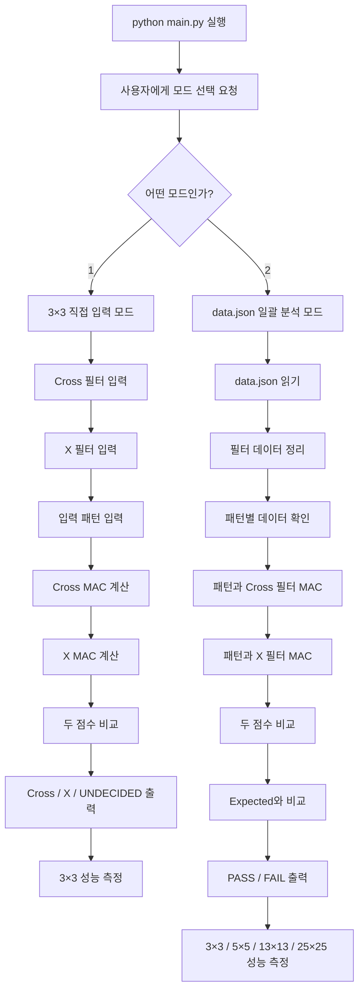

위 그림을 한 문장으로 줄이면 다음과 같습니다.

> **입력을 받고 → MAC으로 점수를 계산하고 → 점수를 비교하고 → 결과를 출력한다.**

---

## 4. 프로젝트 파일 구조

현재 저장소의 주요 파일은 다음과 같습니다.

```text
mini-npu-project/
│
├── README.md          # 프로젝트 설명서
├── main.py            # 프로그램 시작점, 입력/JSON 처리
├── engine.py          # MAC과 판정 등 핵심 연산
├── data.json          # 필터와 테스트 데이터
│
└── screenshots/
    ├── main.png
    ├── mode1_result.png
    └── mode2_result.png
```

### 파일별 역할

| 파일 | 역할 |
|---|---|
| `main.py` | 프로그램을 실행하고 사용자 입력과 JSON 데이터를 처리합니다. |
| `engine.py` | 실제 계산을 담당합니다. MAC, 라벨 정규화, 판정, 성능 측정 등이 들어 있습니다. |
| `data.json` | 5×5, 13×13, 25×25용 필터와 테스트 패턴이 저장되어 있습니다. |
| `README.md` | 프로젝트 사용법과 구현 원리를 설명합니다. |
| `screenshots/` | 실행 결과를 보여주는 이미지가 들어 있습니다. |

핵심 구조는 다음과 같습니다.

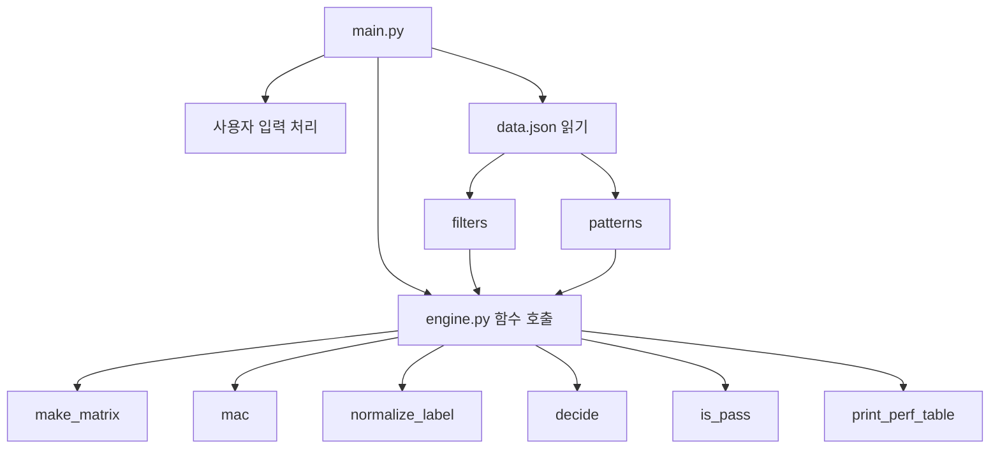

쉽게 말하면 `main.py`는 **진행자**, `engine.py`는 **계산 담당자**, `data.json`은 **문제 데이터**입니다.

---

## 5. 실행 환경

- Python **3.8 이상** 권장
- 외부 Python 패키지 설치 필요 없음
- NumPy 등의 수치 연산 라이브러리를 사용하지 않음
- Python 표준 라이브러리만 사용

프로젝트의 파일을 같은 디렉터리에 두고 실행합니다.

```bash
python main.py
```

> `main.py`는 `data.json`을 상대경로로 읽습니다. 따라서 가장 안전한 방법은 **프로젝트 루트 디렉터리에서 `python main.py`를 실행하는 것**입니다.

---

## 6. 실행하면 무엇이 나오는가?

프로그램을 시작하면 다음 메뉴가 표시됩니다.

```text
============================================================
 Mini NPU 시뮬레이터
============================================================
1) 사용자 입력 (3x3 직접 입력)
2) data.json 분석 (5x5 / 13x13 / 25x25)
```

### 모드 1

직접 숫자를 입력해서 MAC 결과를 확인합니다.

### 모드 2

`data.json`에 들어 있는 테스트 케이스를 한 번에 실행하고 PASS/FAIL을 확인합니다.

---

# 7. 모드 1: 3×3 직접 입력

모드 1에서는 다음 세 가지를 직접 입력합니다.

```text
1. Cross 필터
2. X 필터
3. 입력 패턴
```

각각 3×3 행렬입니다.

예를 들어 입력 패턴이 Cross 모양이라면 다음과 같이 생길 수 있습니다.

```text
0 1 0
1 1 1
0 1 0
```

### 모드 1 처리 과정

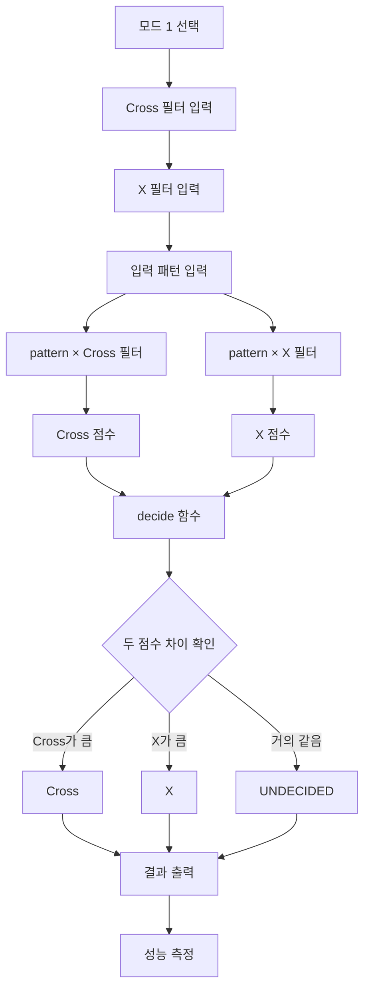

---

# 8. 모드 2: data.json 일괄 분석

모드 2에서는 사용자가 직접 행렬을 입력하지 않습니다.

대신 다음 과정을 수행합니다.

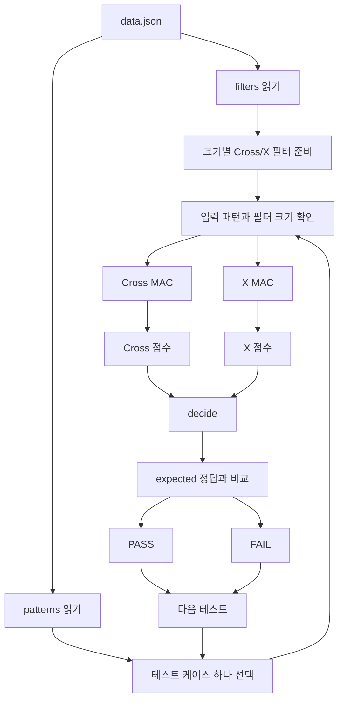

### `data.json`의 기본 개념

데이터는 크게 두 부분으로 생각하면 됩니다.

```text
filters
 └── 크기별 Cross / X 필터

patterns
 └── 입력 패턴 + expected 정답
```

예를 들어 `size_5`는 5×5 크기의 필터를 의미하고, `size_5_1`은 5×5 테스트 케이스 중 하나를 의미합니다.

---

# 9. `engine.py` 이해하기

`engine.py`는 프로젝트에서 가장 중요한 계산 로직을 모아 놓은 파일입니다.

현재 핵심 함수는 다음과 같습니다.

```text
make_matrix()
mac()
normalize_label()
decide()
is_pass()
print_perf_table()
```

---

## 9.1 `make_matrix()`

```python
make_matrix(size, data)
```

이 함수의 목적은 **행렬의 크기가 올바른지 검사하는 것**입니다.

예를 들어 `size=3`이면 3개의 행이 있어야 하고, 각 행에도 3개의 값이 있어야 합니다.

```text
3×3 행렬

행 1 → 값 3개
행 2 → 값 3개
행 3 → 값 3개
```

크기가 다르면 `ValueError`를 발생시킵니다.

현재 구현에서는 `data=None`이라는 기본 인자가 선언되어 있지만 실제 코드에서는 `data`에 대해 바로 `len(data)`를 호출합니다. 따라서 `make_matrix(3)`만 호출하면 자동으로 0행렬을 만드는 함수는 아닙니다.

즉, 이 함수는 현재 구현상 **행렬 생성기라기보다 행렬 크기 검증기**에 가깝습니다.

---

## 9.2 `mac()`

이 프로젝트의 핵심입니다.

```python
score = 0

for i in range(size):
    for j in range(size):
        score += pattern[i][j] * filt[i][j]
```

이 코드는 다음을 의미합니다.

```text
모든 행을 돌면서
    모든 열을 돌면서
        입력값 × 필터값
        를 score에 누적
```

이를 수학적으로 표현하면 다음과 같은 형태입니다.

```text
score = Σ(pattern[i][j] × filter[i][j])
```

### 왜 2중 반복문인가?

행렬은 행과 열로 되어 있기 때문입니다.

```mermaid
flowchart TD
    A[행렬 입력] --> B[i = 0 ... N-1]
    B --> C[j = 0 ... N-1]
    C --> D[pattern[i][j] × filter[i][j]]
    D --> E[score에 더하기]
    E --> C
    C --> F[모든 열 처리 완료]
    F --> B
    B --> G[모든 행 처리 완료]
    G --> H[최종 score 반환]
```

---

# 10. Cross와 X 필터는 왜 필요한가?

입력 패턴 자체를 보고 사람이 직접 판단하지 않고, **두 개의 필터와 비교한 점수**로 판단합니다.

예를 들어 입력이 Cross 모양이라면 Cross 필터와 같은 위치에 값이 많이 겹칠 가능성이 높습니다.

그러면 Cross 필터와 계산한 MAC 점수가 높아집니다.

반대로 X 모양이면 X 필터와의 점수가 높아질 수 있습니다.

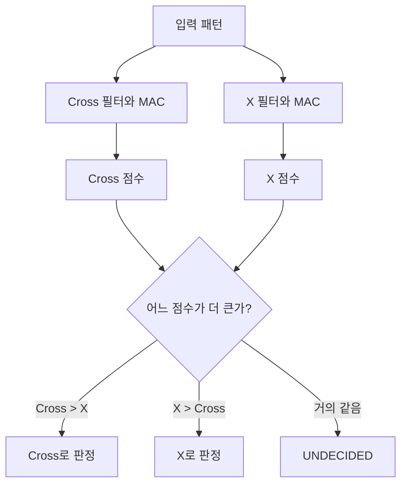

즉, **필터는 해당 모양에 얼마나 잘 반응하는지를 계산하기 위한 기준**이라고 생각하면 됩니다.

---

# 11. `normalize_label()`

데이터마다 같은 의미를 다른 문자열로 적을 수 있습니다.

예를 들어 Cross를 다음처럼 표현할 수 있습니다.

```text
+
cross
```

X도 다음처럼 표현할 수 있습니다.

```text
x
X
```

그래서 프로그램 내부에서는 이를 하나의 형식으로 통일합니다.

```text
+      → Cross
cross  → Cross
x      → X
```

코드에서는 입력값을 먼저 다음과 같이 처리합니다.

```python
text = str(raw).strip().lower()
```

각 메서드의 의미는 다음과 같습니다.

- `str(...)`: 문자열로 변환
- `strip()`: 앞뒤 공백 제거
- `lower()`: 소문자로 통일

---

# 12. `decide()`와 `UNDECIDED`

두 점수를 단순히 비교하면 다음처럼 생각할 수 있습니다.

```text
Cross 점수 > X 점수 → Cross
Cross 점수 < X 점수 → X
Cross 점수 = X 점수 → 동점
```

하지만 컴퓨터의 부동소수점 계산에서는 아주 작은 오차가 발생할 수 있습니다.

예를 들어 사람이 보기에는 같아도 내부적으로 다음처럼 저장될 가능성이 있습니다.

```text
0.9
0.9000000000000001
```

그래서 이 프로젝트에서는 `EPSILON`을 사용합니다.

```python
EPSILON = 1e-9
```

두 점수의 차이가 `1e-9`보다 작으면 사실상 같은 점수로 취급합니다.

```mermaid
flowchart TD
    A[Cross 점수] --> C[두 점수의 차이 계산]
    B[X 점수] --> C

    C --> D[abs(Cross - X)]
    D --> E{차이 < 1e-9?}

    E -->|예| F[UNDECIDED]
    E -->|아니오| G{Cross > X?}

    G -->|예| H[Cross]
    G -->|아니오| I[X]
```

### 왜 `UNDECIDED`가 중요한가?

둘 중 하나를 억지로 선택하면 잘못된 분류가 될 수 있습니다.

따라서 프로그램은 애매한 경우를 명시적으로 `UNDECIDED`라고 표시합니다.

---

# 13. `is_pass()`

모드 2에서는 모델의 판정만으로 끝나지 않습니다.

`data.json` 안에는 **expected**, 즉 정답이 들어 있습니다.

예를 들어:

```text
모델 판정 = Cross
expected  = Cross
```

이면 PASS입니다.

반대로:

```text
모델 판정 = X
expected  = Cross
```

이면 FAIL입니다.

또한 현재 구현에서는 `UNDECIDED`도 PASS로 인정하지 않고 FAIL로 처리합니다.

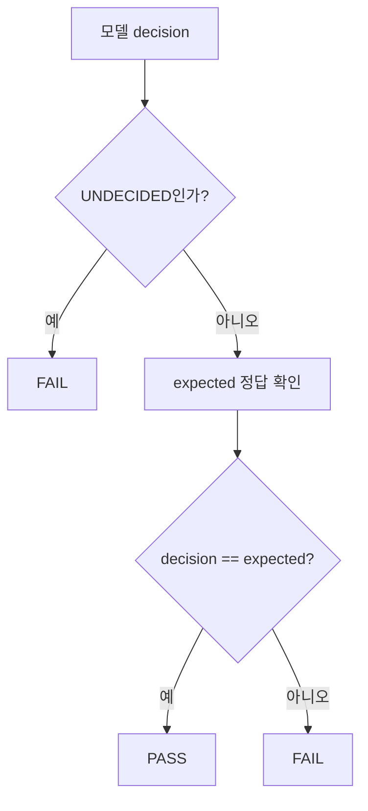

---

# 14. 왜 어떤 테스트는 FAIL인가?

모드 2에서는 현재 일부 테스트가 FAIL로 나옵니다.

중요한 점은 이 FAIL이 반드시 프로그램의 오류를 의미하는 것은 아니라는 것입니다.

현재 결과에서 실패한 대표 케이스는 **두 필터의 점수가 같아 `UNDECIDED`가 된 경우**입니다.

즉:

```text
Cross 점수 = X 점수
        ↓
UNDECIDED
        ↓
정답을 결정하지 못함
        ↓
현재 채점 정책에서는 FAIL
```

이는 `evaluate_case()`와 `is_pass()`의 현재 정책에 따른 정상적인 결과입니다.

---

# 15. 성능 측정

프로젝트는 MAC 연산에 걸리는 시간도 측정합니다.

현재 테스트 크기는 다음과 같습니다.

```text
3×3
5×5
13×13
25×25
```

각 크기에서 더미 행렬을 만들고 `mac()`을 여러 번 실행해 평균 시간을 구합니다.

### 왜 여러 번 실행하는가?

한 번만 측정하면 운영체제나 Python 실행 환경의 순간적인 영향을 크게 받을 수 있습니다.

여러 번 실행하고 평균을 내면 보다 안정적인 비교가 가능합니다.

현재 함수의 기본 반복 횟수는 `10`입니다.

```python
def print_perf_table(sizes, repeat=10):
```

단, 출력 문구에 `10회 반복`이 문자열로 직접 적혀 있기 때문에 나중에 `repeat` 값을 바꾼다면 출력 문구도 함께 수정하는 것이 좋습니다.

---

# 16. 시간 복잡도 O(N²)

`mac()`은 다음과 같은 구조입니다.

```python
for i in range(size):
    for j in range(size):
        ...
```

행이 `N`개이고 각 행에 열이 `N`개이므로 총 `N × N`개의 위치를 확인합니다.

```text
N × N = N²
```

따라서 시간 복잡도는

```text
O(N²)
```

입니다.

### 크기가 커지면 왜 시간이 늘어나는가?

```text
3×3  →     9번
5×5  →    25번
13×13 →  169번
25×25 →  625번
```

행렬의 한 변이 커질수록 전체 칸 수는 제곱으로 증가합니다.

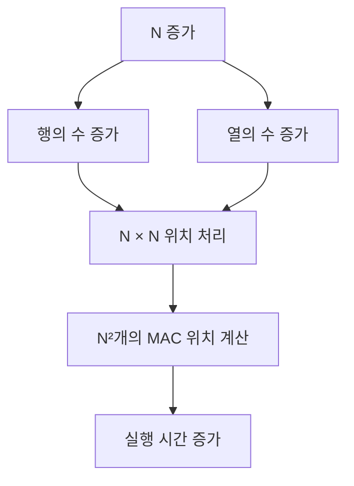

단, 실제 측정 시간이 정확히 N²배로 증가하지는 않습니다. 실제 실행 시간에는 Python 인터프리터, 함수 호출, 운영체제 스케줄링 등의 오버헤드가 함께 포함되기 때문입니다.

---

# 17. `main.py`는 어떻게 동작하는가?

`main.py`는 전체 프로그램을 연결하는 역할을 합니다.

전체 구조를 단순화하면 다음과 같습니다.

```mermaid
flowchart TD
    A[main()] --> B[메뉴 출력]
    B --> C{사용자 입력}

    C -->|1| D[run_mode1()]
    C -->|2| E[run_mode2()]
    C -->|그 외| F[오류 메시지]

    F --> B

    D --> G[read_matrix_from_input()]
    G --> H[make_matrix()]
    H --> I[mac()]
    I --> J[decide()]
    J --> K[결과 출력]
    K --> L[print_perf_table()]

    E --> M[data.json 읽기]
    M --> N[build_filters()]
    N --> O[evaluate_case()]
    O --> P[mac()]
    P --> Q[decide()]
    Q --> R[is_pass()]
    R --> S[PASS / FAIL 출력]
    S --> T[print_perf_table()]
```

---

# 18. `main.py`의 중요한 함수

## `get_size_from_key()`

```text
size_5_1 → 5
size_13_2 → 13
size_25_1 → 25
```

테스트 케이스 이름에서 행렬 크기를 추출합니다.

## `get_size_from_filter_key()`

```text
size_5 → 5
size_13 → 13
size_25 → 25
```

필터 이름에서 크기를 추출합니다.

## `read_matrix_from_input()`

사용자가 입력하는 한 줄을 읽고 숫자로 변환한 뒤 행렬을 구성합니다.

잘못된 개수의 값을 입력하거나 숫자가 아닌 값을 입력하면 다시 입력하도록 합니다.

## `build_filters()`

`data.json`의 필터 데이터를 프로그램에서 사용하기 편한 구조로 정리합니다.

## `evaluate_case()`

하나의 테스트 케이스를 검사하는 핵심 함수입니다.

```text
케이스 확인
   ↓
크기 확인
   ↓
입력 행렬 확인
   ↓
expected 확인
   ↓
Cross MAC
   ↓
X MAC
   ↓
decide
   ↓
is_pass
   ↓
PASS / FAIL
```

## `run_mode2()`

`data.json`을 읽고 모든 테스트 케이스를 순서대로 평가합니다.

마지막에는 전체 개수와 PASS/FAIL 개수를 출력합니다.

---

# 19. 모드 2 전체 평가 흐름

모드 2를 한 장으로 이해하면 다음과 같습니다.

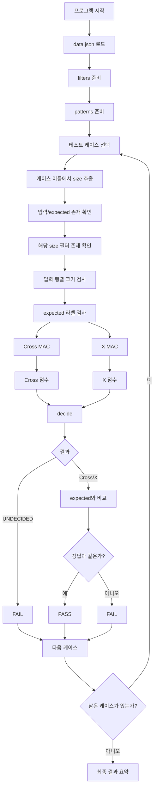

---

# 20. 현재 실행 결과를 어떻게 해석하는가?

기존 실행에서는 다음과 같은 형태의 결과가 나옵니다.

```text
전체: 6 / 통과: 3 / 실패: 3
```

여기서 `FAIL`이 3개라고 해서 곧바로 코드를 잘못 작성했다고 판단하면 안 됩니다.

현재 구현에서는 다음과 같은 경우가 FAIL이 될 수 있습니다.

```text
1. 입력 데이터 자체의 형식 오류
2. 필터 데이터 누락
3. expected 라벨 오류
4. 실제 분류 결과와 expected가 다름
5. Cross와 X 점수가 같아 UNDECIDED가 됨
```

따라서 FAIL이 나오면 **FAIL의 사유(reason)를 함께 확인하는 것**이 중요합니다.

---

# 21. 이 프로젝트에서 배우는 핵심 Python 개념

이 프로젝트는 단순히 NPU만 공부하는 프로젝트가 아닙니다.

Python 입문자의 관점에서도 다음 내용을 연습할 수 있습니다.

### 함수

```python
def mac(pattern, filt):
```

### 조건문

```python
if score_cross > score_x:
```

### 반복문

```python
for i in range(size):
    for j in range(size):
```

### 리스트

```python
[[1, 0, 1],
 [0, 1, 0],
 [1, 0, 1]]
```

### 예외 처리

```python
try:
    ...
except ValueError:
    ...
```

### 파일 읽기

```python
with open(path, "r", encoding="utf-8") as f:
```

### JSON 처리

```python
raw = json.load(f)
```

### 모듈 import

```python
from engine import mac, decide
```

### 문자열 처리

```python
strip()
lower()
split()
```

즉, 작은 프로젝트 안에서 여러 Python 기본 문법이 실제 문제 해결에 사용됩니다.

---

# 22. 처음 코드를 읽는 사람에게 추천하는 순서

처음부터 모든 코드를 한꺼번에 이해하려고 하지 않는 것이 좋습니다.

다음 순서로 읽으면 훨씬 쉽습니다.

```mermaid
flowchart TD
    A[README의 프로젝트 개요] --> B[main.py의 main()]
    B --> C[run_mode1 / run_mode2]
    C --> D[engine.py의 mac()]
    D --> E[decide()]
    E --> F[is_pass()]
    F --> G[data.json 구조]
    G --> H[성능 측정 코드]
```

### 특히 처음에는 이것만 기억하면 됩니다.

```text
main.py
→ 프로그램을 움직인다.

engine.py
→ 계산한다.

data.json
→ 계산에 사용할 데이터를 제공한다.
```

그리고 핵심 계산은:

```text
입력 × 필터
     ↓
    MAC
     ↓
   점수
     ↓
 점수 비교
     ↓
Cross / X / UNDECIDED
```

입니다.

---

# 23. 코드 품질 관점에서 확인한 개선 포인트

현재 코드는 작은 교육용 프로젝트로서는 구조가 비교적 명확합니다. 다만 다음 부분은 추후 개선할 수 있습니다.

### 1. `make_matrix()`의 기본 인자

현재:

```python
def make_matrix(size, data=None):
```

실제 구현은 `data=None`일 때 처리하지 않고 바로 `len(data)`를 사용합니다.

둘 중 하나로 통일하는 것이 좋습니다.

- 정말 기본 0행렬을 만들고 싶다면 `data is None` 처리 추가
- 아니면 `data`를 필수 인자로 변경

### 2. 성능 출력 문구

현재 함수는 `repeat` 인자를 받지만 화면에는 `10회 반복`이 고정되어 있습니다.

다음처럼 바꾸는 것이 더 안전합니다.

```python
print(f"\n[성능 분석] MAC 연산 평균 시간 ({repeat}회 반복)")
```

### 3. `__pycache__` 관리

현재 저장소에는 Python 실행 과정에서 생성되는 `__pycache__` 디렉터리가 포함되어 있습니다.

일반적으로 Git 저장소에서는 `.gitignore`를 통해 제외하는 편이 좋습니다.

예:

```gitignore
__pycache__/
*.pyc
```

### 4. 실행 위치 의존성

현재 `run_mode2()`는 기본적으로 다음 파일을 찾습니다.

```python
open("data.json", "r", encoding="utf-8")
```

따라서 현재는 프로젝트 루트에서 실행하는 것이 가장 안전합니다.

향후에는 `pathlib`을 사용해 `main.py`의 위치를 기준으로 `data.json`을 찾도록 만들 수도 있습니다.

---

# 24. 프로젝트를 한 문장으로 설명한다면

> **Mini NPU 시뮬레이터는 순수 Python으로 MAC 연산을 구현하고, Cross와 X 필터의 점수를 비교하여 입력 패턴을 분류하는 간단한 NPU 연산 시뮬레이터입니다.**

---

# 25. 가장 중요한 개념만 다시 정리

```text
NPU
└── 신경망 연산을 빠르게 처리하는 프로세서

MAC
└── 곱한 값을 계속 더하는 연산

필터
└── 특정 패턴에 얼마나 잘 반응하는지 계산하기 위한 기준

Cross 점수
└── 입력과 Cross 필터의 MAC 결과

X 점수
└── 입력과 X 필터의 MAC 결과

decide()
└── 두 점수를 비교해서 Cross / X / UNDECIDED 결정

expected
└── 정답 라벨

is_pass()
└── 모델 결과가 정답과 같은지 확인

O(N²)
└── N×N 행렬의 모든 위치를 순회하기 때문에 발생하는 시간 복잡도
```

---

## 26. 실행 예시

```bash
python main.py
```

모드 1:

```text
1) 사용자 입력 (3x3 직접 입력)
```

모드 2:

```text
2) data.json 분석 (5x5 / 13x13 / 25x25)
```

---

## 27. 스크린샷

### 메인 화면

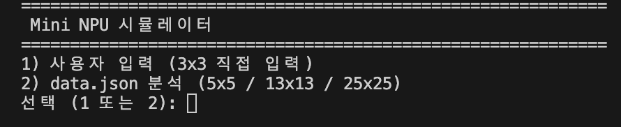

### 모드 1 결과

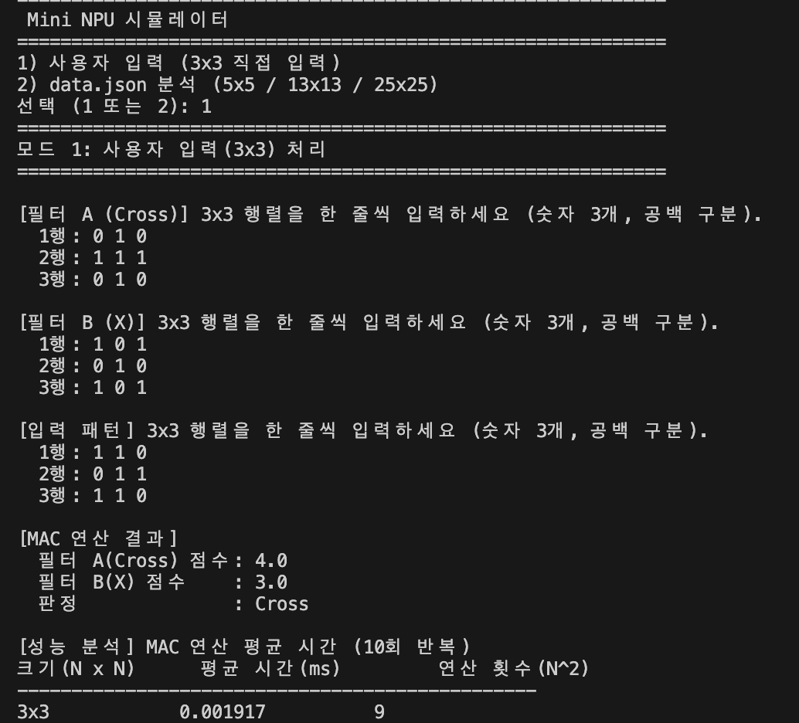

### 모드 2 결과

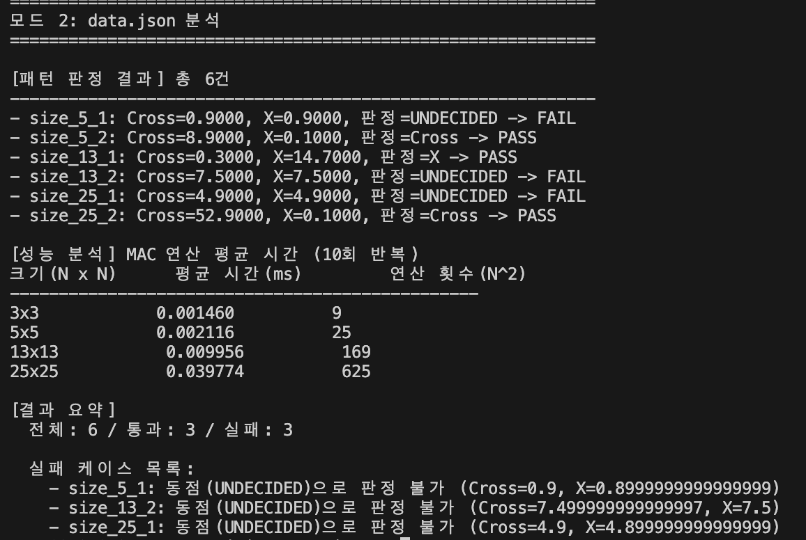

---

## 28. 마무리

이 프로젝트에서 가장 먼저 이해해야 할 부분은 NPU의 모든 구조가 아니라 **MAC 연산이 어떻게 점수로 연결되는지**입니다.

다음 흐름만 확실하게 이해하면 전체 코드가 훨씬 쉬워집니다.

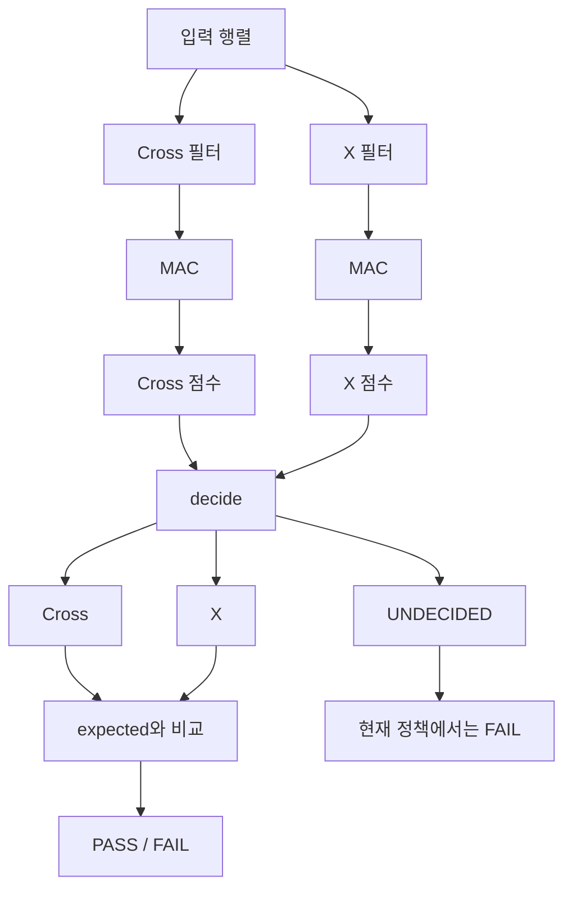

**입력 → MAC → 점수 → 비교 → 판정 → 채점**

이것이 이 프로젝트의 핵심 흐름입니다.
